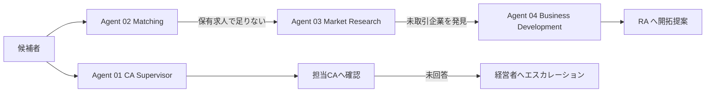

# AI Agent 仕様

4 つの Agent がそれぞれ独立した責務を持ち、出力が次の Agent の入力になる。



## 共通方針

### ブラックボックスにしない

推奨するスコアには必ず要素別の内訳（配点・獲得点・判定理由）を残し、画面に表示する。「なぜこの点になったか」を管理者が追跡できることを必須とする。

### 推測しない

情報が無い項目は推測で加点せず、**不足情報**として明示し Confidence を下げる。

| Confidence | 条件 |
| --- | --- |
| High | 不足情報なし |
| Medium | 不足情報 1〜2 件 |
| Low | 不足情報 3 件以上、または LLM 未使用（ルールベースのみ） |

### LLM が無くても動く

LLM を使う処理はすべて「ルールベースで結果を作る → LLM が利用可能なときだけ上書きする」構造。`AI_PROVIDER=mock` でも全機能が動作する。

### AI が勝手に確定してよい範囲

| AI が自動更新してよい | 人の確認が必要 |
| --- | --- |
| AI タグ / スキル抽出 | 選考辞退 |
| 推奨求人・マッチングスコア | 転職活動終了 |
| WEB 調査結果 | 年収希望の変更 |
| アラート生成 | 企業への候補者推薦 |
| 次回アクションの提案 | 個人情報の開示 |
| 見送り理由タグの**提案** | 見送り理由タグの**確定** |

AI による変更はすべて `audit_logs` に `actor_type='AI'` で記録される。

---

## Agent 01: CA Supervisor Agent

候補者の進捗を監視し、対応漏れを防ぐ。

| | |
| --- | --- |
| **Trigger** | 毎朝（候補者監視）／毎夕（未対応再確認）／管理画面からの手動実行 |
| **Input** | 稼働候補者、活動履歴、選考状況、フェーズ別 SLA 設定、エスカレーション設定 |
| **Logic** | フェーズごとに「起点(anchor)」と「充足条件(satisfied)」を判定し、期限超過を検出 → アラート生成 → CA へ AI 確認 → 未回答なら再通知 → 経営者へエスカレーション |
| **Output** | `ai_alerts` / `ai_interactions` / 通知 / `audit_logs` |
| **実装** | `src/lib/agents/ca-supervisor.ts` + `src/lib/domain/sla.ts` |

### SLA 判定の仕組み

一律の「N 日更新なし」では判定しない。チェック種別ごとに、期限の起点と解消条件を定義する。

| alert_type | 起点 (anchor) | 解消条件 (satisfied) | 既定 | Lv |
| --- | --- | --- | --- | --- |
| `interview_not_scheduled` | 直近の架電/メール | 未来日の次回アクション日が設定済み | 24h | 2 |
| `jobs_not_proposed` | 直近の面談 | 起点以降に `job_proposal` がある | 24h | 2 |
| `intent_not_confirmed` | 直近の `job_proposal` | 起点以降に `intent_check` または `recommend` がある | 48h | 2 |
| `not_recommended` | 直近の `intent_check` | 起点以降に `recommend` または応募レコードがある | 翌営業日 | 3 |
| `screening_stalled` | 最古の書類選考中の応募日 | 企業回答が入っている | 168h | 2 |
| `interview_prep_missing` | 直近の推薦/対策 | 起点以降に `interview_prep` がある | 面接 48h 前 | 3 |
| `interview_feedback_missing` | 直近の対策/推薦 | 起点以降に `interview_feedback` がある | 24h | 2 |
| `offer_follow_missing` | 直近の `offer_follow` | （常に再評価）内定中は定期フォローが必要 | 24h | 3 |
| `hold_recontact_due` | 次回接触予定日 | （予定日を過ぎたら常に検出）未設定自体も検出 | 予定日 | 2 |
| `next_action_overdue` | 次回アクション予定日 | — | 予定日 | 2 |

期限・レベルは管理画面から変更できる。

### アラートレベル

| Lv | 意味 | 条件 |
| --- | --- | --- |
| 1 | 注意 | 期限の `warnRatio`（既定 75%）を経過 |
| 2 | 遅延 | 期限を超過 |
| 3 | 重大 | ルール自体が Lv3（内定者フォロー / 推薦未実施 / 面接対策未実施）、CA が AI 確認に未回答、または**重要候補者 (S/A ランク) を 72 時間以上放置** |

Lv3 の条件を絞っているのは、全件が重大になると優先順位が機能しなくなるため。Lv3 のみ経営者へ即時通知する（管理画面で無効化可能）。

### CA への AI 確認

```
山田 太郎様について、2026/09/03が対応予定日でしたが進捗の更新がありません。
検知内容: 次回アクション期日超過: 次回アクション「内定条件の最終確認」の予定日を超過

現在の状況を教えてください。
1. 候補者返信待ち   2. 求人検討中   3. 連絡済み   4. 連絡予定
5. 選考辞退         6. 転職活動休止  7. その他

自由記述でも構いません
（例:「昨日電話しましたが出なかったため、明日再度電話します。」）
```

回答は選択肢・自由記述の両方を受け付け、以下へ構造化する（`src/lib/agents/ca-response.ts`）。

```json
{
  "status": "contacted",
  "statusLabel": "連絡済み",
  "last_contact_date": "2026-09-04T...",
  "next_action": "架電",
  "next_action_date": "2026-09-05T10:00:00",
  "memo": "昨日電話しましたが出なかったため、明日再度電話します。",
  "confidence": "Medium"
}
```

「候補者返信待ち」「求人検討中」「連絡予定」で日付が読み取れない場合は、**2 営業日後を既定の再確認日として必ず設定する**。期日のない状態を作らないことで放置を構造的に防ぐ。

### エスカレーション

```
期限超過 → CAへAI確認 → 回答 → 情報更新 → 終了
                     ↓ firstReminderHours 未回答
                     再通知
                     ↓ escalationHours 未回答
                     経営者へエスカレーション + ca_no_response アラート (Lv3)
```

---

## Agent 02: Matching Agent

候補者の経歴を構造化し、PORTERS 内求人とのマッチングを行う。

| | |
| --- | --- |
| **Trigger** | 候補者登録・更新時／候補者詳細画面からの手動実行／定期実行 |
| **Input** | 職務経歴テキスト、スキル、資格、希望条件、募集中求人、マッチング重み設定 |
| **Logic** | ①スキル・資格の構造化 ②要素別スコアリング ③理由・懸念・不足情報の抽出 |
| **Output** | `candidate_skills` / `candidate_qualifications` / `candidate_company_matches` / `ai_interactions` |
| **実装** | `src/lib/agents/matching.ts` + `src/lib/domain/matching.ts` + `src/lib/domain/taxonomy.ts` |

### ① 構造化

タクソノミ（`taxonomy.ts`）による表記ゆれの正規化を行う。**最長一致**を採るため、「予防保全」が「設備保全」の別名「保全」に吸収されることはない。

```
第三種電気主任技術者 → 電験三種
1級電気工事施工管理技士 → 電気工事施工管理技士
現場監督 → 施工管理
ビル管理 → ファシリティマネジメント
```

抽出したスキルには根拠となった原文の一文を `evidence` として保存する。人が入力した値（`source='human'`）は AI が上書きしない。

### ② スコアリング（100 点満点）

| 要素 | 既定配点 | 判定 |
| --- | --- | --- |
| 経験職種 | 25 | 経験一致=満点 / 希望職種=70% / 許容職種=45% |
| 必須スキル | 20 | 一致率で按分 |
| 業界経験 | 10 | 同業界=満点 / 近接業界（製造・プラント・建設間）=50% |
| 資格 | 10 | 保有率で按分。指定なしは中立として 50% |
| 勤務地 | 10 | 一致=満点 / 転勤可=60% / 要相談=30% |
| 年収 | 10 | 希望額が求人上限内=満点 / 最低希望のみ充足=60% |
| 希望仕事内容 | 10 | 第一希望=満点 / 許容=50% |
| その他 | 5 | 歓迎スキル一致、マネジメント経験 |

**減点**: NG 職種に該当 `-30` / 夜勤不可に夜勤あり求人 `-10` / 転勤不可に転勤あり求人 `-8`

配点は管理画面から変更できる。

### ③ 出力例

```
95/100  西日本重工業株式会社 / 設備保全エンジニア（大阪工場）  Confidence: Medium
  合う理由: 設備保全の実務経験が求人要件と一致 / 必須スキル 設備保全・PLC・予防保全 を保有
            / 電験三種を保有 / 希望勤務地と一致 / 希望年収レンジ内
  懸念:     なし
  不足情報: 転勤可否が不明
```

### 過去実績の参照

類似候補者（**同一主職種 かつ 経験年数 ±3 年**）の過去実績を併記する。母数が 5 件未満の場合は「参考値」と明示し、**Match Score には反映しない**（ADR-005）。

---

## Agent 03: Market Research Agent

候補者の経歴から、WEB 上で「採用可能性のある企業」を探す。求人→候補者ではなく **候補者→企業** の逆方向マッチング。

| | |
| --- | --- |
| **Trigger** | 候補者詳細画面からの手動実行／毎週（S・A ランク候補者が対象） |
| **Input** | **匿名化された候補者プロフィールのみ** |
| **Logic** | 匿名化 → 検証 → 検索 → 情報源の信頼度順に並べ替え → 企業特定 → 未取引判定 → 保存 |
| **Output** | `companies`（未取引）/ `web_job_findings` / `candidate_company_matches` (`web_company`) |
| **実装** | `src/lib/agents/market-research.ts` + `src/lib/domain/anonymize.ts` |

### 個人情報の扱い

検索クエリに渡すのは匿名プロフィールのみ。

```
34歳 / 大阪府 / 化学メーカー / 設備保全8年 / PLC / シーケンス制御 / 電験三種
```

送信前に `assertNoDirectIdentifiers()` でメールアドレス・電話番号・詳細住所（丁目・番地）のパターンを検査し、氏名の混入も個別に検査する。違反を検知した場合は**例外を投げて処理を止める**（黙って送信しない）。住所は都道府県までに丸める。

### 情報源の優先順位

企業公式採用サイト → 企業公式ニュース → 求人媒体 → 転職サイト → 採用関連ニュース → その他

各件について取得日・情報源・URL・求人タイトル・勤務地・主な要件・推定適合度・**最終確認日**を保存する。WEB 情報には鮮度があるため、`markStaleFindings()` が一定期間確認されない情報を `stale` にする。

勤務地は検索結果から確実に読み取れた場合のみ設定する。候補者の希望勤務地を企業所在地として保存しない。

### 未取引企業の判定

自社 DB に存在しない企業 = 未取引として `transaction_status='unknown'` で登録する。

---

## Agent 04: Business Development Agent

発見した企業について「営業すべきか」を評価し、優先順位を付ける。

| | |
| --- | --- |
| **Trigger** | 新規開拓画面からの手動実行／毎週 |
| **Input** | 未取引・開拓中の企業、その企業への候補者マッチ全件、WEB 求人情報、重点領域設定 |
| **Logic** | 7 要素でスコアリング。**1 候補者ではなく保有候補者プール全体との相性**を評価 |
| **Output** | `business_development_opportunities` |
| **実装** | `src/lib/agents/business-development.ts` |

### スコアリング（100 点満点）

| 要素 | 既定配点 | 判定 |
| --- | --- | --- |
| 候補者適合度 | 30 | 最上位候補者の Match Score |
| 現在の採用需要 | 25 | 公開求人の件数 × 情報の鮮度 |
| 保有候補者との相性 | 15 | Match 60 以上の候補者数（8 名で満点） |
| 当社重点領域との相性 | 10 | 施工管理・設備保全・プラント等との一致 |
| 継続的な求人可能性 | 10 | 企業規模 × 募集職種の幅 |
| 採用規模 | 5 | 確認できたポジション数 |
| 推定紹介フィー | 5 | 対象候補者の平均希望年収 |

配点は管理画面から変更できる。

### 1 候補者だけで判断しない

「保有候補者との相性」「継続的な求人可能性」の 2 要素（計 25 点）が、単発求人と継続取引先を分ける。生成される理由文も候補者数に応じて変わる。

- 0 名 … 「公開求人は確認したが、現時点で高スコアの保有候補者はいない。求人内容の詳細確認が必要。」
- 1 名 … 「候補者 1 名との適合は確認できるが、単発求人の可能性がある。」
- 複数 … 「最上位候補者との Match は N。加えて当社保有の〇〇人材 M 名（S ランク x 名 / A ランク y 名）との親和性が高く、単発求人ではなく継続的な採用支援先になる可能性がある。」

### RA への営業提案

企業名・開拓優先度・採用中求人・候補者 Match 数・開拓理由・アプローチ切り口・想定担当部署・提案可能候補者の概要・営業用メッセージ案を生成する。

**営業文面には候補者を特定できる情報を含めない。** 氏名は `stripNames()` で除去し、記載するエリアは企業所在地ではなくマッチした候補者の居住地の最頻値から出す（事実と異なる記載を避けるため）。企業への実際の情報開示には `candidate_disclosure_consent` が必須。

営業進捗（`status`）と担当 RA は人が管理する項目のため、Agent の再実行では上書きしない。

---

## 補助処理

### 見送り理由タグの提案

企業からの見送り理由の原文を 15 種のタグに分類する。**原文は決して変更せず、AI は提案するだけで確定は人が行う。**

```
"電気設計の実務経験が要件に届かないため今回は見送りとさせていただきます。"
  → 経験不足 (Confidence: Medium)
     根拠: 原文中の表現「実務経験が要件に届か」に基づく判定
```

実装: `src/lib/agents/rejection-tagging.ts`

### レポート生成

| レポート | Trigger | 宛先 | 内容 |
| --- | --- | --- | --- |
| 日次 CA 運用レポート | 毎日 | 経営者・管理者 | 稼働数、正常/要確認/遅延/重大、CA 別状況、重要事項、AI 推奨 Action |
| 週次 BD レポート | 毎週 | 経営者・管理者・RA | 今週発見した未取引企業数、開拓推奨企業 TOP10 |

実装: `src/lib/agents/reports.ts`

### ナレッジ集計

職種別・業界別・年齢別・資格別・経験年数別・企業別の通過率、キャリアチェンジ成功パターン（「設備保全 → 生産技術」等の遷移別通過率）、見送り理由タグの分布を集計する。

実装: `src/lib/domain/knowledge.ts`
