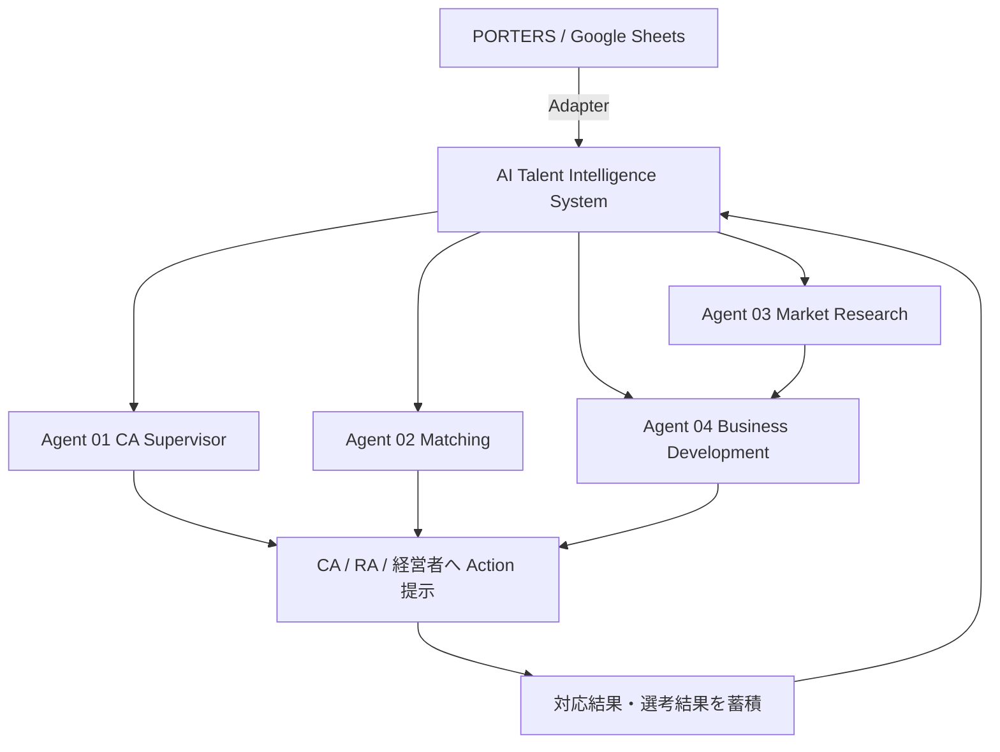

# アーキテクチャ

## 1. 設計思想

PORTERS を **Source of Truth** とし、本システムはその上に「AI による判断層」を載せる。基幹データを置き換えず、基幹側が持たない情報（AI 判断結果・マッチングスコア・WEB 調査結果・アラート・学習用データ）を保持する。



蓄積した結果が次回の判断精度を上げる、という循環が本システムの目的である。

## 2. レイヤ構成

依存は上から下への一方向のみ。アプリケーションロジックは外部サービスの実装を知らない。

```
  画面 (src/app)            Server Components / Server Actions
    ↓
  Agent 層 (src/lib/agents) 業務判断のオーケストレーション
    ↓
  Domain 層 (src/lib/domain) SLA 判定・スコアリング・匿名化・集計（純粋関数中心）
    ↓
  Adapter 層 (src/lib/adapters) 外部サービスの抽象化
    ↓
  データ (Prisma)
```

### Adapter 層

| Adapter | interface | 実装 | 未設定時 |
| --- | --- | --- | --- |
| データソース | `TalentDataSource` | `PortersDataSource` / `GoogleSheetsDataSource` / `MockDataSource` | Mock へフォールバック |
| LLM | `AiProvider` | `AnthropicProvider` / `OpenAiProvider` / `GeminiProvider` / `MockAiProvider` | Mock（ルールベース） |
| WEB 検索 | `SearchProvider` | `BraveSearchProvider` / `SerperSearchProvider` / `TavilySearchProvider` / `MockSearchProvider` | Mock |
| 通知 | `NotificationProvider` | SMTP / Slack / Console | Console + DB ログ |

いずれも API 障害時は Mock へ落ちる。**外部サービスの不調で業務が止まらない**ことを優先している。

LLM を使う処理はすべて「ルールベースの結果を先に作り、LLM が使えるときだけ上書きする」構造にしている。したがって `AI_PROVIDER=mock` でもシステム全体が意味のある出力を返す。

## 3. データフロー

### 3.1 取り込み

```
PORTERS / Sheets / Mock
  → TalentDataSource.fetchXxx()   （DTO へ正規化）
  → syncFromDataSource()          （突合キー: external_id）
  → DB
```

基幹側の値は `source='human'` として保存し、AI 抽出値より優先する。取り込みは read 方向のみで、本システムから基幹側を書き換えない。

### 3.2 監視 → 確認 → エスカレーション

```
毎朝 monitor
  → evaluateSla()  フェーズ別 SLA で期限超過を検出
  → ai_alerts 生成 (Level 1/2/3)
  → Level 2 以上: 担当 CA へ AI 状況確認 (first_notification_at)
  → 未回答が firstReminderHours 経過: 再通知 (second_notification_at)
  → さらに escalationHours 経過: 経営者へエスカレーション (escalated_at)
  → Level 3: 経営者へ即時通知

CA が回答
  → parseCaResponse()  選択肢 + 自由記述 → 構造化
  → candidate_actions / candidates を更新
  → アラートを answered へ
```

### 3.3 候補者起点の新規開拓

```
候補者
  → anonymizeProfile()          氏名/連絡先/詳細住所を除去
  → assertNoDirectIdentifiers() 送信前に検証（違反時は例外で停止）
  → SearchProvider.search()
  → companies (未取引は transaction_status='unknown') + web_job_findings
  → candidate_company_matches (matchType='web_company')
  → evaluateCompany()           プール全体との相性を含めて BD Score 算出
  → business_development_opportunities
```

## 4. 画面一覧

| パス | 画面 | 主な利用者 | 目的 |
| --- | --- | --- | --- |
| `/login` | ログイン | 全員 | 認証 |
| `/` | ロール別リダイレクト | 全員 | 最初に見るべき画面へ |
| `/dashboard/ca` | 今日やること | CA | 優先順位付き Todo |
| `/dashboard/executive` | Executive Dashboard | 経営者 | 稼働状況・CA 別・ファネル・新規開拓・日次レポート |
| `/candidates` | 候補者一覧 | CA / RA | 担当CA・職種・勤務地・フェーズ・期限超過・年収・資格・スキルで絞込 |
| `/candidates/[id]` | 候補者詳細 | CA | 基本情報・経歴・スキル・希望・AI 解析・選考・履歴・推奨求人・WEB 企業 |
| `/jobs` | 求人一覧 | CA / RA | 職種・勤務地・年収で絞込 |
| `/companies` | 企業一覧 | RA | 取引状況・採用需要・業界・勤務地・開拓 Score で絞込 |
| `/companies/[id]` | 企業詳細 | RA | 取引状況・求人・過去推薦者・通過率・マッチ候補者・WEB 採用情報・開拓理由 |
| `/matching` | AI Matching | CA | PORTERS 内 TOP3 / WEB 上 TOP3 を根拠付きで |
| `/business-development` | 新規開拓 | RA | BD Score 順・営業進捗・営業文面案・週次レポート |
| `/alerts` | アラート | CA / 経営者 | Level 別一覧と AI 確認への回答 |
| `/knowledge` | ナレッジ分析 | 経営者 | 軸別通過率・キャリアチェンジ成功パターン・見送り理由分布 |
| `/admin/settings` | 設定 | 管理者 | SLA・重み・エスカレーション・定期実行・ジョブ手動実行 |
| `/admin/audit` | 監査ログ | 管理者 | 変更履歴（AI/人間の区別）・通知履歴 |
| `/search` | 検索結果 | 全員 | 候補者・企業・求人・スキル・資格の横断検索 |

### UI 方針

業務システムのため装飾を抑え、情報密度・視認性・優先順位・操作速度を優先する。状態は**色だけに依存せず**、記号（`○ △ ! ■`）とテキストを併記する。

| 状態 | 色 | 記号 |
| --- | --- | --- |
| 正常 | ニュートラル | `○` |
| 注意 (Lv1) | Yellow | `△` |
| 遅延 (Lv2) | Orange | `!` |
| 重大 (Lv3) | Red | `■` |
| 完了 | Green | `○` |

PC ファースト。スマートフォンでは横スクロール可能なテーブルとして閲覧・更新できる。

## 5. API 設計

画面からの更新は Server Actions（`src/app/actions/`）で行い、外部から叩く必要があるものだけ Route Handler にしている。

### Route Handlers

| メソッド | パス | 認証 | 用途 |
| --- | --- | --- | --- |
| `GET` | `/api/health` | なし | DB と各 Adapter の状態 |
| `POST` | `/api/cron/{job}` | `Authorization: Bearer $CRON_SECRET` | 定期ジョブ実行 |

`{job}`: `sync` / `monitor` / `escalation` / `matching` / `market_research` / `bd_ranking` / `daily_report` / `weekly_bd_report`

`CRON_SECRET` 未設定時、本番環境では 401 を返す（開発時のみ素通し）。

### Server Actions

| ファイル | Action | 権限 |
| --- | --- | --- |
| `actions/auth.ts` | `loginAction` / `logoutAction` | — |
| `actions/candidates.ts` | `recordActionAction` | `candidate:write` |
| | `updatePhaseAction` | `candidate:write` |
| | `respondToAlertAction` | 自分宛アラートのみ |
| | `runCandidateAgentsAction` | `candidate:read_all` |
| | `confirmRejectionTagAction` | `candidate:write` |
| | `suggestRejectionTagAction` | 認証済み |
| `actions/business-development.ts` | `updateOpportunityAction` / `rerankOpportunitiesAction` | `bd:write` |
| `actions/settings.ts` | `updateMatchWeightsAction` ほか / `runJobAction` | `settings:write` |

## 6. フォルダ構成

```
infralink/
├ prisma/
│  ├ schema.prisma              データモデル（provider 切替可）
│  └ seed.ts                    デモデータ投入 + 全 Agent 実行
├ scripts/
│  ├ reset-db.mjs               ローカル SQLite の作り直し
│  ├ switch-datasource.mjs      sqlite ⇔ postgresql
│  ├ run-agents.ts              定期ジョブの CLI 実行
│  ├ sync-sheets.ts             データソース取り込み
│  └ export-sheets-template.ts  Google Sheets 用 CSV 生成
├ src/
│  ├ app/
│  │  ├ (app)/                  認証済みシェル配下の全画面
│  │  ├ actions/                Server Actions
│  │  ├ api/                    Route Handlers
│  │  └ login/
│  ├ components/                UI 部品・フォーム
│  └ lib/
│     ├ adapters/
│     │  ├ ai/                  LLM Provider 抽象
│     │  ├ search/              Web Search Provider 抽象
│     │  ├ notification/        通知 Provider 抽象
│     │  └ datasource/          PORTERS / Sheets / Mock
│     ├ agents/                 Agent 01〜04・CA 回答解析・見送り理由タグ・レポート
│     ├ domain/                 SLA・マッチング・タクソノミ・匿名化・集計・日付
│     ├ demo/                   デモ用フィクスチャ
│     ├ views/                  画面向けの読み取りモデル
│     ├ auth.ts / rbac.ts / audit.ts / settings.ts / sync.ts / db.ts / json.ts
└ docs/
```

## 7. 技術選定

| 領域 | 採用 | 理由 |
| --- | --- | --- |
| Frontend / Backend | Next.js 15 (App Router) + TypeScript | 画面と業務ロジックを同一言語・同一リポジトリで保守できる |
| DB | PostgreSQL（本番） / SQLite（開発既定） | 開発は外部依存ゼロで起動でき、本番は PostgreSQL（ADR-002） |
| ORM | Prisma | 型安全なスキーマ定義と両 DB 対応 |
| UI | Tailwind CSS | 情報密度を細かく制御でき、業務システム向けの調整がしやすい |
| 認証 | bcrypt + 署名付き JWT (jose) を httpOnly Cookie | 外部 IdP に依存せず、将来 SSO へ差し替え可能（ADR-003） |
| バリデーション | zod | Server Action の入力検証 |

## 8. 拡張ポイント

| やりたいこと | 触る場所 |
| --- | --- |
| LLM を変更 | `src/lib/adapters/ai/` に Provider を追加し `getAiProvider()` へ登録 |
| 検索エンジンを変更 | `src/lib/adapters/search/` |
| 通知を Slack へ | `NOTIFICATION_PROVIDER=slack` + `SLACK_WEBHOOK_URL` |
| PORTERS を接続 | `src/lib/adapters/datasource/porters.ts` の `mapXxx()` をテナント項目に合わせる |
| SLA / 重みを変更 | 管理画面（コード変更不要）。既定値は `src/lib/settings.ts` |
| スキル辞書を追加 | `src/lib/domain/taxonomy.ts` |
| 権限を細分化 | `src/lib/rbac.ts` の `PERMISSIONS` と `ROLE_PERMISSIONS` |
