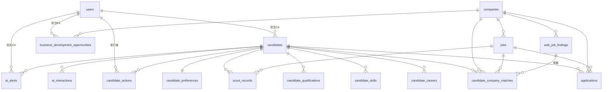

# データベース設計

## 1. ER 図



監査・設定系（`audit_logs` / `system_settings` / `notification_logs` / `job_run_logs`）は他テーブルと疎結合で、`entity_type` + `entity_id` で参照する。

## 2. 設計上の約束

### 2.1 列挙値は String

Prisma の `enum` と scalar list を使わない。SQLite と PostgreSQL の双方で同一スキーマを動かすため（[DECISIONS.md](DECISIONS.md) ADR-002）。列挙値の定義は `src/lib/domain/enums.ts` に集約し、DB は String で保持する。

### 2.2 配列・構造化データは JSON 文字列

`required_skills` や `match_reason` などは JSON 文字列として String 列に保存する。読み書きは `src/lib/json.ts` の `parseList()` / `parseJson()` / `toJson()` を通す。

### 2.3 外部 ID による突合

基幹データとの突合は `porters_id` / `porters_job_id` / `external_id` で行う。**氏名をキーにしない。**

### 2.4 原文は消さない

`applications.rejection_reason_original`（企業からの見送り理由）は決して上書き・削除しない。AI が提案するタグは `rejection_reason_tag` に、人が確定した場合のみ `rejection_tag_confirmed_by` に記録する。

### 2.5 AI 由来か人間由来かを区別する

`candidate_skills.source` / `candidate_qualifications.source` は `ai` / `human`。同期で取り込んだ基幹側の値は `human` とし、AI 抽出はこれを上書きしない。`candidate_actions.actor` と `audit_logs.actor_type` も同様に `human` / `AI` / `system` を区別する。

---

## 3. テーブル定義

### users

| 列 | 型 | 説明 |
| --- | --- | --- |
| id | String PK | |
| name | String | |
| email | String UNIQUE | ログイン ID |
| password_hash | String | bcrypt |
| role | String | `admin` / `executive` / `CA` / `RA` |
| active | Boolean | 無効化された利用者はログインもセッション継続も不可 |
| created_at / updated_at | DateTime | |

### candidates

| 列 | 型 | 説明 |
| --- | --- | --- |
| id | String PK | |
| porters_id | String? UNIQUE | 基幹側 ID |
| name / name_kana / email / phone | String? | 直接識別情報。外部へ渡さない |
| age / location | Int? / String? | |
| current_salary / desired_salary | Int? | 円 |
| job_change_timing | String? | `immediate` / `within_3m` / `within_6m` / `passive` |
| owner_ca_id | String? FK→users | 担当 CA |
| source | String? | `porters` / `sheets` / `manual` / `scout` |
| status | String | `active` / `on_hold` / `placed` / `closed` |
| phase | String | 下記フェーズ |
| rank | String? | `S` / `A` / `B` / `C` |
| last_contact_date / next_action / next_action_date | | SLA 判定の入力 |
| disclosure_consent | Boolean | 企業への情報開示に対する本人同意 |
| ai_summary / ai_structured_at | | AI 構造化の入力と最終実行時刻 |

**フェーズ**: `pre_interview` 初回面談前 / `interviewed` 面談済み / `jobs_proposed` 求人提案済み / `apply_intent` 応募意思あり / `document_screening` 書類選考中 / `interview_scheduled` 面接予定 / `post_interview` 面接後 / `offer` 内定 / `on_hold` 保留 / `closed` 終了

### candidate_careers

`candidate_id` / `company_name` / `industry` / `job_category` / `job_title` / `start_date` / `end_date` / `is_current` / `years_experience` / `description` / `management_count` / `project_scale`

### candidate_skills

`candidate_id` + `skill_name` で UNIQUE。`skill_category`（`technical` / `equipment` / `software` / `domain` / `management`）、`skill_level`、`years_experience`、`evidence`（抽出根拠となった原文の一文）、`source`。

### candidate_qualifications

`candidate_id` + `qualification_name` で UNIQUE。`acquired_date` / `source`。

### candidate_preferences

`candidate_id` PK。`desired_locations` / `desired_jobs` / `acceptable_jobs` / `ng_jobs`（JSON 配列）、`minimum_salary` / `desired_salary`、`transfer_allowed` / `business_trip_allowed` / `night_shift_allowed`（`yes` / `no` / `negotiable` / `unknown`）、`priority_1..3`。

### candidate_actions

| 列 | 説明 |
| --- | --- |
| external_id | 基幹側 ID（UNIQUE） |
| candidate_id / ca_id | |
| action_type | `call` / `mail` / `meeting` / `job_proposal` / `intent_check` / `recommend` / `interview_prep` / `interview_feedback` / `offer_follow` / `follow_up` / `ai_check` |
| action_date / memo / next_action / next_action_date | |
| actor | `human` / `AI` |

`action_type` は SLA 判定の充足条件そのもの。たとえば「求人提案済み → 意向確認」の SLA は、`job_proposal` を起点に `intent_check` または `recommend` が記録されたかで判定する。

### companies

`external_id` UNIQUE / `company_name` / `transaction_status`（`existing` 既存取引 / `prospect` 開拓中 / `unknown` 未取引）/ `industry` / `location` / `website` / `relationship_status` / `employee_count` / `note`。

Market Research Agent が発見した企業は `transaction_status='unknown'` で登録される。所在地は**検索結果から判明した場合のみ**設定し、候補者の希望勤務地を流用しない。

### jobs

`porters_job_id` UNIQUE / `company_id` / `job_title` / `job_category` / `location` / `salary_min` / `salary_max` / `required_skills` / `preferred_skills`（JSON 配列）/ `required_experience` / `qualifications`（JSON 配列）/ `description` / `status`（`open` / `closed` / `on_hold`）/ `source`。

### applications

| 列 | 説明 |
| --- | --- |
| external_id | UNIQUE |
| candidate_id / job_id / company_id | |
| application_date / current_stage | ステージは下記 |
| document_result / interview_1_result / interview_2_result / final_result | `pass` / `fail` / `pending` |
| offer_status / acceptance_status / offer_deadline | 内定・承諾・承諾期限 |
| rejection_reason_original | **企業からの原文。不可逆に保持** |
| rejection_reason_tag / rejection_tag_confirmed_by | AI 提案タグ / 人による確定 |

**ステージ**: `proposed` / `applied` / `document_screening` / `interview_1` / `interview_2` / `final` / `offer` / `accepted` / `rejected` / `withdrawn`

**見送り理由タグ**: 経験不足 / 業界経験 / 職種経験 / 資格 / 年齢 / 転職回数 / 年収 / 勤務地 / 学歴 / コミュニケーション / 志望動機 / キャリア志向 / カルチャーフィット / 他候補比較 / その他

### web_job_findings

`company_id` / `job_title` / `source_url` / `source_type` / `location` / `requirements` / `salary` / `estimated_fit` / `found_at` / `last_verified_at` / `active_status`。

WEB 情報には鮮度があるため `last_verified_at` を必須で保持し、一定期間確認されないものは `active_status='stale'` にする。

**source_type**（信頼度順）: `official_career` 企業公式採用サイト → `official_news` 企業公式ニュース → `job_board` 求人媒体 → `agent_media` 転職サイト → `news` 採用関連ニュース → `other`

### candidate_company_matches

`candidate_id` / `company_id` / `job_id` / `finding_id` / `match_type`（`internal_job` PORTERS 内求人 / `web_company` WEB 発見企業）/ `match_score` / `breakdown`（要素別の獲得点 JSON）/ `match_reason` / `risk` / `missing_info`（JSON 配列）/ `confidence`（`High` / `Medium` / `Low`）。

`breakdown` に全要素の配点と獲得点、判定理由を残すため、スコアは常に説明可能。

### business_development_opportunities

`company_id` / `score` / `breakdown` / `matching_candidate_count` / `s_rank_count` / `a_rank_count` / `hiring_demand_score` / `reason` / `recommended_action` / `approach_angle` / `target_department` / `draft_message` / `status` / `owner_ra_id`。

**営業進捗 (status)**: `not_started` 未着手 / `planned` アプローチ予定 / `approached` アプローチ済 / `replied` 返信あり / `meeting` 商談 / `negotiating` 契約交渉 / `contracted` 契約 / `declined` 見送り

`status` と `owner_ra_id` は人が管理する項目のため、Agent の再実行時に上書きしない。

### ai_alerts

`candidate_id` / `ca_id` / `alert_level`（1 注意 / 2 遅延 / 3 重大）/ `alert_type` / `reason` / `detected_at` / `due_at` / `first_notification_at` / `second_notification_at` / `escalated_at` / `status`（`open` / `answered` / `resolved` / `escalated` / `dismissed`）/ `resolved_at`。

`(candidate_id, alert_type, status)` に UNIQUE 制約を置き、同一の指摘が重複して積み上がらないようにしている。

**alert_type**: `interview_not_scheduled` / `jobs_not_proposed` / `intent_not_confirmed` / `not_recommended` / `screening_stalled` / `interview_prep_missing` / `interview_feedback_missing` / `offer_follow_missing` / `hold_recontact_due` / `next_action_overdue` / `ca_no_response`

### ai_interactions

`agent_type`（`ca_supervisor` / `matching` / `market_research` / `business_development`）/ `candidate_id` / `user_id` / `alert_id` / `question` / `response` / `structured_result` / `provider` / `confidence`。

AI とのやり取りを全件残し、後から判断根拠を追跡できるようにする。

### scout_records

`candidate_id` / `job_id` / `scout_sent` / `scout_sent_at` / `scout_opened` / `scout_replied` / `meeting_booked` / `applied` / `media`。

「候補者属性 × 求人 × 返信率」を学習するための器。

### system_settings

`key` PK / `value`（JSON）/ `updated_at` / `updated_by`。

キー: `sla` / `match_weights` / `bd_weights` / `escalation` / `schedule` / `focus_areas`。既定値はコード側（`src/lib/settings.ts`）にあり、DB に行があればそれで上書きする。

### audit_logs

`actor_type`（`human` / `AI` / `system`）/ `actor_id` / `actor_label` / `entity_type` / `entity_id` / `action`（`create` / `update` / `delete` / `notify` / `escalate`）/ `before` / `after`（JSON）/ `created_at`。

### notification_logs / job_run_logs

送信した通知（宛先・件名・本文・成否）と、定期ジョブの実行履歴（開始・終了・結果・エラー）。

---

## 4. PostgreSQL への移行

```bash
npm run db:use-postgres                     # provider を postgresql に書き換え
# .env の DATABASE_URL を PostgreSQL の接続文字列に変更
npx prisma migrate dev --name init          # 本番相当はマイグレーション運用を推奨
```

スキーマは enum / scalar list を使わないため、provider の切り替えだけで移行できる。`npm run db:reset` は SQLite 専用（PostgreSQL に対して破壊的操作を行わないためのガード）。
